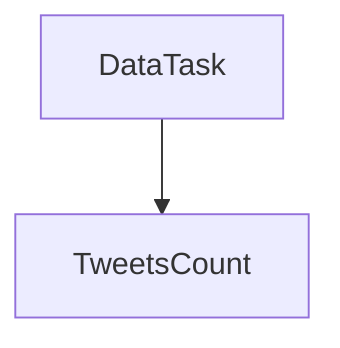

# README - Data Pipeline

## Repository structure

The application code reside in ``src/`` and the tests are in ```tests/``` and data is located in ```data/```.


### Some details of the structure and the usage

#### The root folder ```src/``` <a name="root-folder"></a>

In the root code folder ``src/`` we mainly have:

- ``read_write`` holds code to read/write data
- ``computations`` contains all data pipeline
- ``utils`` holds a set of utilities used across the code base
- ``main.py`` defines a single entrypoint to the data pipeline. It contains a ``main`` function 
#### The ``computations`` module <a name="data-module"></a>

Here we maintain all needed code for data related tasks: e.g. computing ``metrics``. In the
sections below, we detail further each submodule.


- ``schema.py`` defines all the schemas for all tables we have. For example ``tweets`` would define all the column names
  and column fields of the ``tweets`` table, similarly, ``project metrics`` defines all the columns we generate in metrics computations
  etc.

- ``task.py`` where we define abstract classes for ``DataTask``, which
  holds common information used downstream in each corresponding submodule.


- ``tweets_counts.py`` a data task which computes basic metrics on tweets.


### Task types structure

**Note:** the graph below will show rendered and very nice on GitHub as well
by [the end of Q1 2022](https://github.com/github/roadmap/issues/372) . To enable this in PyCharm, Go to Settings ->
Languages & Frameworks -> Markdown and install then enable the Mermaid
extension [reference](https://www.jetbrains.com/help/pycharm/markdown.html#diagrams).



The root element is the ``DataTask`` ([file](/src/computations/task.py)) abstract object which mainly defines an interface
to be implemented by the inheriting material class. Mainly, it considers the following:

- initialization of the ``JobContext`` containing a spark session
- definition of functions that any implementing class shall provide or inherit.

In short, the functions are meant to do the following:

1) ``read`` gets the data,
2) ``transform`` the data by performing the needed computation and returning a Spark DataFrame.
3) ``preview`` is implemented in the ``Task`` class where mainly we first ``read``, then ``transform`` and return the
   resulting DataFrame.


### Installation and set up

1. install spark [installation guide](https://kontext.tech/article/1044/install-spark-321-on-linux-or-wsl)
2. install requirements `pip install -r requirements.txt`
3. run entrypoint